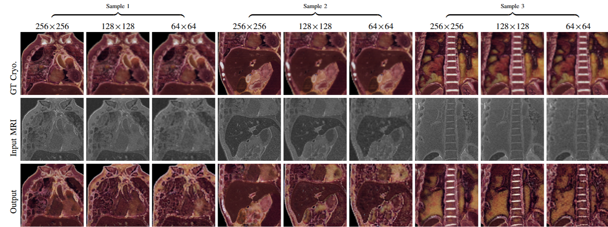
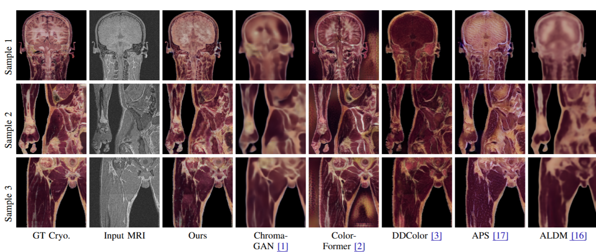

# Structurally Consistent MRI Colorization using Cross-modal Fusion Learning
_Mayuri Mathur, Anav Chaudhary, Saurabh Kumar Gupta, Ojaswa Sharma_  
[IEEE, ISBI]  

## 📄 Introduction
This repository contains the code, data, and supplementary materials for the paper:

📌 **Abstract:**  
_Medical image colorization can greatly enhance the interpretability of the underlying imaging modality and provide insights into human anatomy. The objective of medical image colorization is to transfer a diverse spectrum of colors distributed across human anatomy from Cryosection data to source MRI data while retaining the structures of the MRI. To achieve this, we propose a novel architecture for structurally consistent color transfer to the source MRI data. Our architecture fuses segmentation semantics of Cryosection images for stable contextual colorization of various organs in MRI images. For colorization, we neither require precise registration between MRI and Cryosection images, nor segmentation of MRI images. Additionally, our architecture incorporates a feature compression-and-activation mechanism to capture organ-level global information and suppress noise, enabling the distinction of organ-specific data in MRI scans for more accurate and realistic organ-specific colorization. Our experiments demonstrate that our architecture surpasses the existing methods and yields better quantitative and qualitative results._

## 📊 Results
### Figures
Below are some key figures from the paper:


*Figure 1: MRI colorization results on three scales of resolution..*


*Figure 2: Quantitative comparison of MRI colorization with different methods.*

<!-- ### Tables
Below are some key tables from the paper:

| Metric  | Value |
|---------|-------|
| SSIM | |
| MSSSIM | |
| FSIM  | |
| STSIM  |  | -->

## 📁 Repository Structure
<!-- ```
📂 project-root
├── 📜 paper.pdf                  # Final version of the paper
├── 📂 code                        # Source code for experiments/simulations
│   ├── script1.py
│   ├── script2.py
│   └── ...
├── 📂 data                        # Sample datasets or preprocessing scripts
├── 📂 results                     # Experimental results, figures, plots
├── 📂 models                      # Pretrained models (if applicable)
├── 📜 requirements.txt            # List of dependencies
├── 📜 README.md                   # This file
└── 📜 LICENSE                     # License information
``` -->

<!-- ## 🚀 Getting Started
### Prerequisites
Ensure you have the following installed:
- Python >= 3.x
- Required packages listed in `requirements.txt` -->

### Installation
Clone the repository and install dependencies:
```bash
git clone https://github.com/graphics-research-group/MRI-Colorization-Cross-Modal-Fusion-Learning.git
cd MRI-Colorization-Cross-Modal-Fusion-Learning
```

### Running the Code
To reproduce the experiments:
```bash
python train.py

```

## 📊 Results
Include key figures, tables, or summaries from the paper. Optionally, provide links to additional results.

## 📑 Citation
If you use this work, please cite:
```bibtex
@misc{mathur2024structurallyconsistentmricolorization,
      title={Structurally Consistent MRI Colorization using Cross-modal Fusion Learning}, 
      author={Mayuri Mathur and Anav Chaudhary and Saurabh Kumar Gupta and Ojaswa Sharma},
      year={2024},
      eprint={2412.10452},
      archivePrefix={arXiv},
      primaryClass={eess.IV},
      url={https://arxiv.org/abs/2412.10452}, 
}
```

## 📬 Contact
For questions, feel free to reach out to:
- **Mayuri Mathur** - [Email](mailto:mayurim@iiitd.ac.in)
- Open an issue in this repository.


